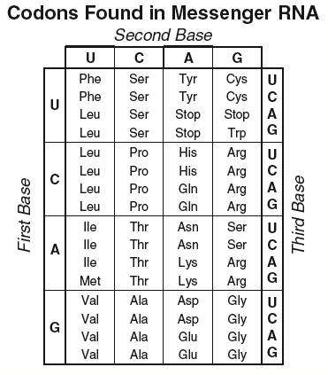

Genetically Modified Organisms (GMOs) have been the topic of ongoing contentious debates. However, not many people truly know what GMOs are, or what they do. 

### What is a GMO?

A GMO is an organism that was modified through technology and engineering. They do this by changing the organism's original DNA. Most GMOs (and the ones at the forefront of the GMO debate) are created from plants.

### How are GMOs made?

GMOs are made in 4 steps, remembered as DRIP:

* __Determine__ : Scientists determine which gene should be put in the organism.
* __Replicate__ : Scientists replicate the aforementioned gene.
* __Infix__ : The scientists infix (put in) the gene into the DNA of the plant.
* __Pullulate__ : The scientists pullulate (grow) the plant and test it in both small and large fields before selling the new organism to farmers.

### Should the public use and consume GMOs?

GMOs are very safe, they are tested before public consumption. As well as this, genetic engineering is important for crop development, shielding crops from pets and other things that could harm their growth, and has helped large scale farmers economically. Overall, GMOs are purely beneficial to use and consume.

### Are GMOs bad for the environment? 

Genetically Modified Organisms can be both good and bad. On one hand, GMOs can reduce the amount of pesticides used on crops, which will help the environment. However, on the other hand, GMOs also may unintentionally mix with other plants and create new types of plants. They can also cause harm to other animals and insects such as monarch butterfly larvae. GMOs' affects on the environment are monitored before they are released to the public, so their safety is usually guaranteed. 

### What are some countries that have banned GMOs?

Some countries think the negative effects of GMOs outweigh the positive ones. Here are some countries that banned GMOs altogether:

* France 
* Germany
* Austria
* Greece
* Hungary

### Are GMOs good?

Like all things in life, GMOs have both pros and cons.

__PROS:__
* Prevents pesticide usage
* Makes crop production faster and easier
* Almost always safe to consume
* Can taste better and ease diets
* Last longer without additives or preservatives

__CONS:__
* Some scientists think cancer may be of risk
* GMOs are very expensive
* Researchers believe they may cause alergies
* GMOs can harm the environment

### DNA, Proteins, and Amino Acids

There are five nitrogen bases when creating nucleotides:
* Adenine
* Guanine
* Thymine
* Cytosine
* Uracil

These 5 bases create nucleic acids such as DNA and RNA. The bases pair up:
* Adenine → Thymine
* Guanine → Cytosine
* __Pairing DNA with RNA:__ Adenine → Uracil

### How DNA structure determines its function

DNA is made up of two polymers in a double helix formation. These polymers are attached by nucleotides, which are two corresponding nitrogen bases brought together. These combinations can form genes, which determines the genetic information for cells. These genes are how DNA determines a cells function. 

### How DNA and RNA code for proteins and determine traits

DNA copies one strand of itself to RNA, called transcription. The ribosome transfers he RNA (tRNA) to the cytoplasm, which will bring the parts of the protein together. In the cytoplasm, chemical reactions take place in order to create proteins. This is called protein synthesis.

### Protein Synthesis

Protein Synthesis is the process of which cells produce proteins. 
__1.__ Transcription of mRNA.
  __1.1__ Created from nucleus from DNA. The RNA will move from the nucleus to the cytoplasm in order to begin the next step. All parts are produced in the ribosomes prior to the migration.
__2.__ Protein synthesis starts.
  __1.1__ tRNA starts the synthesis by moving towards the mRNA. The "code" is put in place and the peptide is ready to start growing.
__3.__ The peptide grows.
  __1.1__ The peptide grows longer as tRNA reads and correctly matches nitrogen bases. 
__4.__ The process ends.
  __1.1__ A stop signal is reached and the process is terminated. The chain leaves the ribosome, and the ribosome is ready to repeat the process.

### Codon chart

DNA bases match as:
* Adenine → Thymine
* Cytosine → Guanine

__However,__ when DNA bases are translated into mRNA:
* Adenine → *Uracil*
* Cytosine → Granine

You can read a codon chart pretty easily by
__1.__ Decoding the DNA sequence
__2.__ Using the new code, look at the left column with the first letter, then the top row with the second letter. Look where these two rows and columns meet, and on the far right row, choose the final letter corresponding with the full 3 letters. 

For example, if you had the translated code UCC UUG AGC, it would translate to leu leu asp.

## Video

## Slides

Click the image.

#### Sources

[Non GMO Project - What is a GMO?](https://www.nongmoproject.org/gmo-facts/what-is-gmo/)

[FDA - How are GMOs Made](https://www.fda.gov/media/135277/download)

[National Geographic - Scientists Say GMO Foods Are Safe, Public Skepticism Remains](https://tinyurl.com/yzalp8ek)

[MedlinePlus](https://tinyurl.com/yepuqzx3)

[ISAAA - GM Crops and the Environment](https://tinyurl.com/ydjbtoqq)

[Protein Synthesis](http://chemistry.elmhurst.edu/vchembook/584proteinsyn.html)
