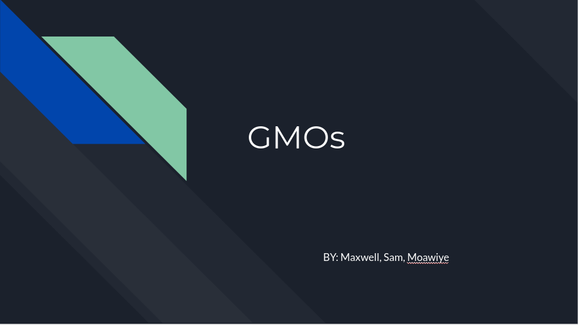

Genetically Modified Organisms (GMOs) have been the topic of ongoing contentious debates. However, not many people truly know what GMOs are, or what they do. 

### What is a GMO?

A GMO is an organism that was modified through technology and engineering. They do this by changing the organism's original DNA. Most GMOs (and the ones at the forefront of the GMO debate) are created from plants.

### How are GMOs made?

GMOs are made in 4 steps, remembered as DRIP:

* __Determine__ : Scientists determine which gene should be put in the organism.
* __Replicate__ : Scientists replicate the aforementioned gene.
* __Infix__ : The scientists infix (put in) the gene into the DNA of the plant.
* __Pullulate__ : The scientists pullulate (grow) the plant and test it in both small and large fields before selling the new organism to farmers.

### Should the public use and consume GMOs?

GMOs are very safe, they are tested before public consumption. As well as this, genetic engineering is important for crop development, shielding crops from pets and other things that could harm their growth, and has helped large scale farmers economically. Overall, GMOs are purely beneficial to use and consume.

### Are GMOs bad for the environment? 

Genetically Modified Organisms can be both good and bad. On one hand, GMOs can reduce the amount of pesticides used on crops, which will help the environment. However, on the other hand, GMOs also may unintentionally mix with other plants and create new types of plants. They can also cause harm to other animals and insects such as monarch butterfly larvae. GMOs' affects on the environment are monitored before they are released to the public, so their safety is usually guaranteed. 

### What are some countries that have banned GMOs?

Some countries think the negative effects of GMOs outweight the positive ones. Here are some countries that banned GMOs altogether:

* France 
* Germany
* Austria
* Greece
* Hungary

### Are GMOs good?

Like all things in life, GMOs have both pros and cons.

__PROS:__
* Prevents pesticide usage
* Makes crop production faster and easier
* Almost always safe to consume
* Can taste better and ease diets
* Last longer without additives or preservatives

__CONS:__
* Some scientists think cancer may be of risk
* GMOs are very expensive
* Researchers believe they may cause alergies
* GMOs can harm the environment

## Video

## Slides

Click the image.

#### Sources

[Non GMO Project - What is a GMO?](https://www.nongmoproject.org/gmo-facts/what-is-gmo/)

[FDA - How are GMOs Made](https://www.fda.gov/media/135277/download)

[National Geographic - Scientists Say GMO Foods Are Safe, Public Skepticism Remains](https://tinyurl.com/yzalp8ek)

[MedlinePlus](https://tinyurl.com/yepuqzx3)

[ISAAA - GM Crops and the Environment](https://tinyurl.com/ydjbtoqq)
