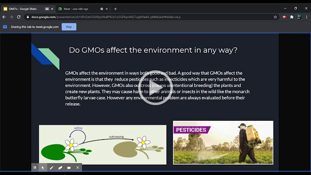

Genetically Modified Organisms (GMOs) have been the topic of ongoing contentious debates. However, not many people truly know what GMOs are, or what they do. 

### What is a GMO?

A GMO is an organism that was modified through technology and engineering. They do this by changing the organism's original DNA. Most GMOs (and the ones at the forefront of the GMO debate) are created from plants.

### How are GMOs made?

GMOs are made in 4 steps, remembered as DRIP:

* __Determine__ : Scientists determine which gene should be put in the organism.
* __Replicate__ : Scientists replicate the aformentioned gene.
* __Infix__ : The scientists infix (put in) the gene into the DNA of th eplant.
* __Pullulate__ : The scientists pullulate (grow) the plant and test it in both small and large fields before selling the new organism to farmers.

### Should the public use and consume GMOs?

GMOs are very safe, they are tested before public consumption. As well as this, genetic engineering is important for crop development, shielding crops from pets and other things that could harm their growth, and has helped large scale farmers economically. Overall, GMOs are purely beneficial to use and consume.

## Video

### Slides

link

#### Sources

[Non GMO Project - What is a GMO?](https://www.nongmoproject.org/gmo-facts/what-is-gmo/)

[FDA - How are GMOs Made](https://www.fda.gov/media/135277/download)

[National Geographic - Scientists Say GMO Foods Are Safe, Public Skepticism Remains](https://tinyurl.com/yzalp8ek)

[MedlinePlus](https://tinyurl.com/yepuqzx3)

[ISAAA - GM Crops and the Environment](https://tinyurl.com/ydjbtoqq)
